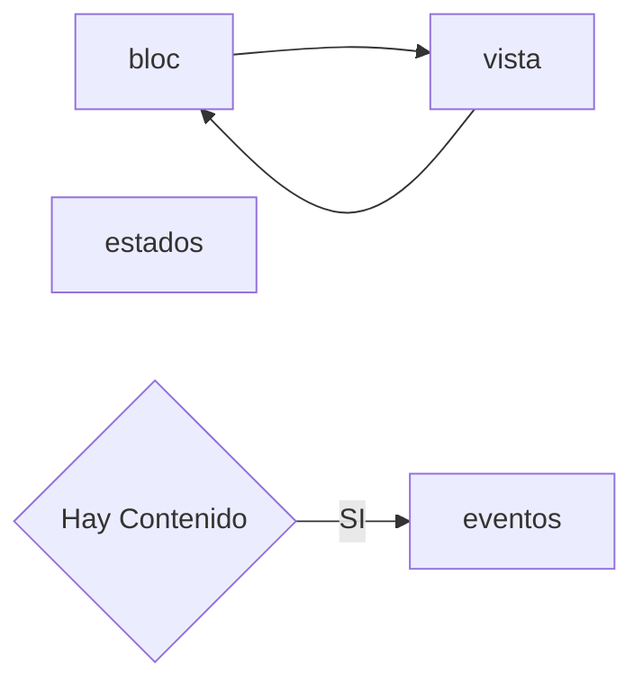

# LoLStadistics

## Resumen

Este proyecto está desarrollador en Flutter con el lenguaje de programación Dart.

## Requisitos
- Instalar y configurar Flutter en el computador. [Link Flutter](https://flutter.dev/docs/get-started/install)
- Instalar y configurar Android Studio. [Link Android](https://developer.android.com/studio)

> Versión de Flutter 2.10.1


### Generar un Build APK

```sh
# Generar un Build APK
flutter build apk
```

### Generar un Build iOS

```sh
# Generar un Build .plist
flutter run --release
```

> NOTA: En este caso tiene que estar el dispositivo conectado al Mac para poder instalar la aplicación.


# Arquitectura App ShopApp

Para este desarrollo la `view` utiliza el gestor de estado `BLoC` y con este se consumen los servicios y actualiza la `view` cuando cambia el estado.

